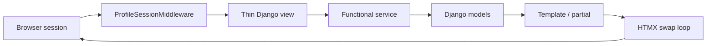
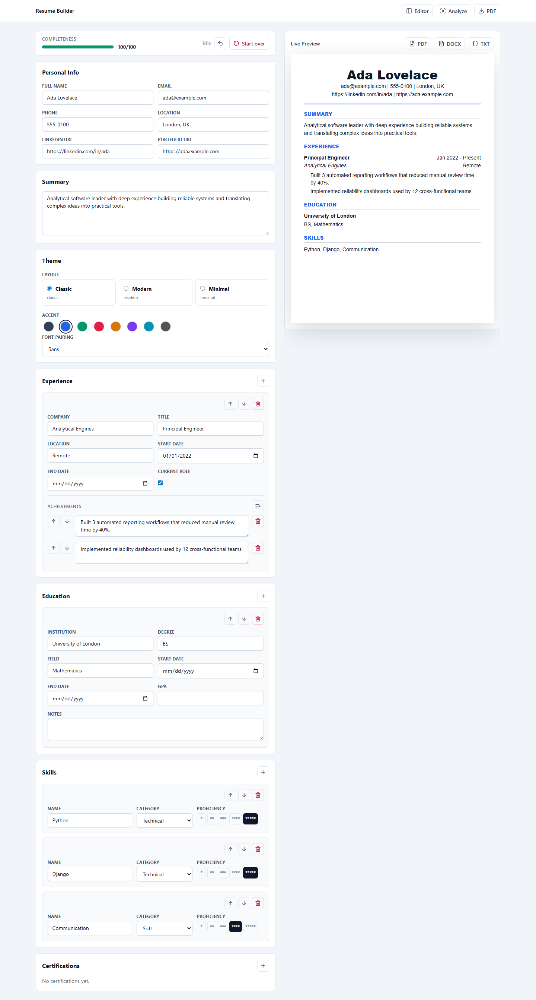
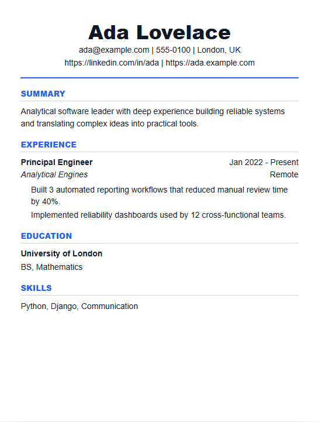
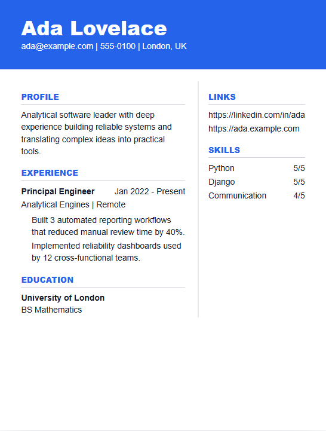
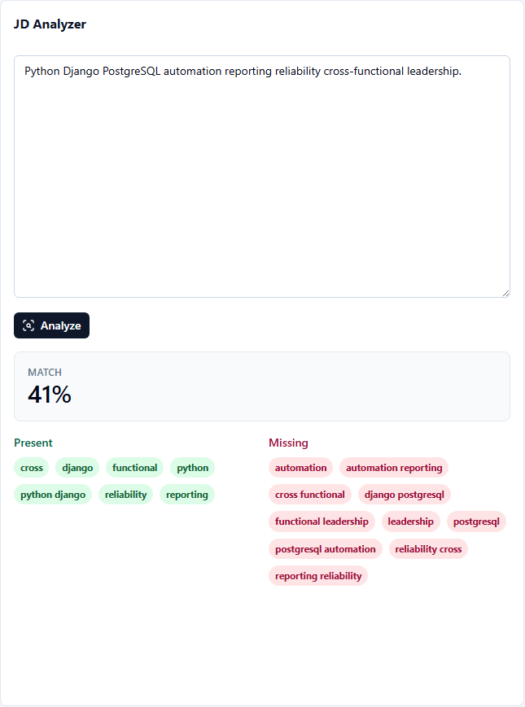

# Resume Builder

Session-only resume builder for quickly creating one polished resume in a browser session, then keeping it by downloading PDF, DOCX, or TXT. There are no accounts, passwords, or saved resume libraries. The session cookie is the identity.

## Features

- Single split-screen editor at `/resume/edit/`.
- HTMX autosave for personal info, summary, themes, experience, bullets, education, skills, and certifications.
- Live preview using the selected resume theme.
- Three layout themes (Classic, Modern, Minimal) with accent colors and font pairings.
- Undo last change and start over; first-visit notice explains the session-only model.
- Export formats: PDF via WeasyPrint (uses your selected theme), DOCX via python-docx (structured plain export; themes apply to PDF only), and ATS-friendly plain text.
- JD analyzer at `/resume/analyze/` with TF-IDF keywords, token-based present/missing groups, and match percentage.
- Vendored frontend assets (Tailwind, HTMX, Lucide) served from static files, not public CDNs.
- Rate limits on exports and analyzer runs (30/hour per session).
- Bullet quality warnings and action verb suggestions.
- Completeness score with a transparent rule breakdown.
- Session pruning command for expired profiles.

## Architecture



Views parse requests and choose templates. Services own business logic: identity helpers, exports, analysis, undo snapshots, and pruning. Models stay normalized because the product has one resume per session, but still benefits from deterministic ordered rows.

## Local Setup

Requires **Python 3.14**.

```powershell
copy .env.example .env
python -m venv .venv
.\.venv\Scripts\Activate.ps1
python -m pip install --upgrade pip
python -m pip install -r requirements-dev.txt
python manage.py migrate
python manage.py runserver
```

Open `http://127.0.0.1:8000/resume/edit/`.

Local development uses SQLite by design for this implementation. Production is configured for PostgreSQL through `DATABASE_URL`.

## Checks

GitHub Actions runs two jobs: **checks** (lint, types, fast unit tests) and **linux-integration** (WeasyPrint, Playwright E2E, screenshot regen).

```powershell
python manage.py check
python -m pytest -m "not e2e and not weasyprint"
```

`check_production_runtime` requires WeasyPrint native libraries (runs in CI **linux-integration** and on Railway release). On Windows without those libs it exits with an error.

```powershell
python -m pytest -m "weasyprint or e2e"
python -m ruff check .
python -m black --check .
python -m isort --check-only .
python -m mypy resumes
```

PDF export uses WeasyPrint when its native text/rendering libraries are available. On Windows machines without the required Pango/GObject runtime, the app falls back to a minimal valid PDF so local development and tests still work; install the WeasyPrint native dependencies for production-quality themed PDFs.

## Data Lifecycle

A profile is keyed by `request.session.session_key`. If cookies are cleared or the session expires, the resume is gone. The intended persistence model is download: PDF, DOCX, or TXT. Run stale profile cleanup with:

```powershell
python manage.py prune_stale_profiles
```

### Railway prune cron

Create a **second Railway service** from the same repo (do not run cron on the web service):

1. Duplicate the service in your Railway project.
2. Set **Start Command** to `python manage.py prune_stale_profiles` (see `railway.prune.toml` and `Procfile` `prune` process).
3. In **Settings → Cron Schedule**, set `0 3 * * *` (03:00 UTC daily) or your preferred interval (minimum 5 minutes apart).
4. Use the same env vars as the web service (`DJANGO_SETTINGS_MODULE`, `DATABASE_URL`, `SECRET_KEY`, etc.).
5. Confirm in **Deploy Logs** after a run:
   - `prune_stale_profiles deleted=N`

The command exits when finished so Railway can schedule the next run.

## Deployment

Required Railway environment variables:

- `DJANGO_SETTINGS_MODULE=resume_builder.settings.prod`
- `SECRET_KEY` (must not be the dev default `dev-only-change-me`; production settings fail fast if it is)
- `DATABASE_URL`
- `ALLOWED_HOSTS`
- `CSRF_TRUSTED_ORIGINS`
- Optional: `SENTRY_DSN`, `LOG_LEVEL`, `SENTRY_TRACES_SAMPLE_RATE`

The app includes `Procfile`, `railway.toml`, `railway.prune.toml`, `nixpacks.toml` (WeasyPrint system libraries), vendored UI assets under `resumes/static/resumes/vendor/`, WhiteNoise static serving, a `/health/` endpoint, and a release command that runs `collectstatic`, migrations, and `check_production_runtime`.

Rebuild vendor assets after UI changes: run `scripts/vendor_frontend_assets.py` for JS; rebuild Tailwind from `frontend/` (see ADR 0010 in `docs/adr/`).

### Confirm WeasyPrint in production logs

After deploy, check **Release Logs** for:

- `production_runtime weasyprint=available` — release succeeded; themed PDF export is ready
- Failed release with `WeasyPrint native runtime is unavailable` — fix `nixpacks.toml` / platform packages and redeploy

On **web service startup** (first request after deploy), look for:

- `startup_check weasyprint=available`

After a PDF download, **Application Logs** should show either:

- `pdf_export renderer=weasyprint theme=classic bytes=...` (expected on Linux with `nixpacks.toml`)
- `pdf_export renderer=fallback theme=...` (warning; PDF is minimal text-only output)

## Screenshots

| Editor | Classic theme (preview) | Modern theme (preview) | JD analyzer |
| --- | --- | --- | --- |
|  |  |  |  |

Regenerate after UI changes:

```powershell
python -m pip install playwright
playwright install chromium
python scripts/generate_readme_screenshots.py
```

## V1 Scope

Included: one session profile, inline editing, undo/start over, themes (layout, accent, font), exports, analyzer, bullet warnings, action verbs, vendored frontend assets, ~82 tests (unit + E2E + WeasyPrint on Linux), ADRs in `docs/adr/` (see `resume_builder_docs.md` Document 1), and Railway prep.

Deferred to v2: accounts, multiple resumes, resume duplication, share links, cover letters, job tracking, LinkedIn import, analytics, real-time collaboration, and LLM-powered features.

## What I Learned

The useful constraint is that persistence moves to the download step. That keeps the application honest: instead of spreading effort across auth and resume libraries, v1 can spend its complexity budget on the editor, export quality, and tailoring feedback. SQLite local development is a deliberate convenience trade-off; production still uses PostgreSQL, and the normalized model keeps the database path straightforward.
